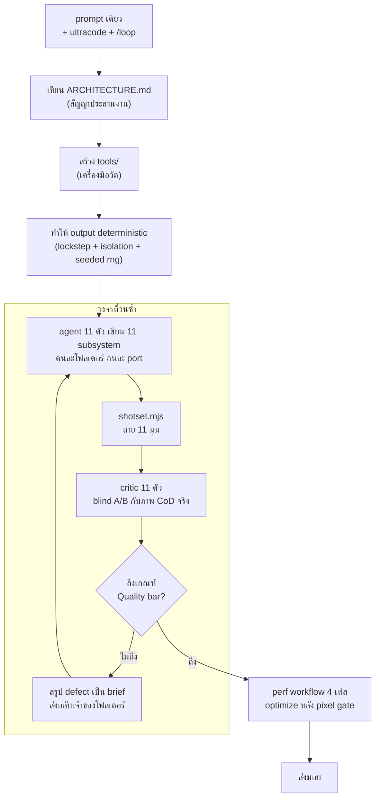

# คู่มือ: สร้างเกม FPS 70,000 บรรทัด ด้วย PROMPT เดียว

> ถอดรหัสวิธีทำจาก repo นี้ (`mshumer/claude-of-duty`) โดยอ่านโค้ดและเอกสารในโปรเจคจริง
> ข้อความในกรอบอ้างอิงทุกอันคัดลอกมาตรงตัวพร้อมเลขบรรทัด

**prompt ยาว 11 บรรทัด ไม่มีคำอธิบายเกมสักคำ — แต่มันสั่งให้ AI สร้าง _เครื่องมือวัดผลงานตัวเอง_ ก่อน**

| วัดอะไร | ผล |
|---|---|
| บรรทัดโค้ด | 69,566 บรรทัด / 172 ไฟล์ |
| subsystem | 11 |
| shot ที่ critic ตรวจ | 11 |
| runtime dependency | 1 (`three`) |
| คะแนนสุดท้าย | 5.05 / 10 |
| ค่า token ประมาณ | ~$860 |

---

## สารบัญ

| # | บท |
|---|---|
| [00](#00-สรุปใน-5-บรรทัด) | สรุปใน 5 บรรทัด |
| [01](#01-เกิดอะไรขึ้นจริง) | เกิดอะไรขึ้นจริง |
| [02](#02-3-คำที่เป็นสวิตช์ของ-harness) | 3 คำที่เป็นสวิตช์ |
| [03](#03-กายวิภาคของ-prompt-11-บรรทัด-5-หน้าที่) | กายวิภาคของ prompt |
| [04](#04-สามเสาที่ต้องเตรียมก่อน-ai-แตะโค้ดเกม) | **สามเสาที่ต้องเตรียม** |
| [05](#05-ระบบทำงานยังไง) | ระบบทำงานยังไง |
| [06](#06-แกะ-perfjs--สคริปต์สั่ง-agent-ตัวจริง) | แกะ `perf.js` ทีละบรรทัด |
| [07](#07-วัด-สวยจริง-ยังไงให้-ai-ตรวจเองได้) | **วัด "สวยจริง" ยังไง** |
| [08](#08-บทเรียนที่แพงที่สุด) | บทเรียนที่แพงที่สุด |
| [09](#09-ค่าใช้จ่ายทั้งหมด) | **ค่าใช้จ่ายทั้งหมด** |
| [10](#10-template--checklist) | Template + Checklist |
| [11](#11-lab--โปรเจคจิ๋วให้ลงมือทำจริง) | LAB ลงมือทำจริง |
| [12](#12-กับดัก-8-ข้อ) | กับดัก 8 ข้อ |

---

## 00 · สรุปใน 5 บรรทัด

1. **prompt สั้นได้เพราะมันไม่ได้อธิบายเกม** — มันเขียนแต่ _เงื่อนไขการตรวจรับ_
2. **สิ่งที่ทำให้สำเร็จคือของ 3 อย่างที่ AI สร้างขึ้นเองก่อนเขียนเกม** — สัญญาประสานงาน, เครื่องมือวัด, และความ deterministic
3. **ถ้าไม่มีเครื่องมือวัด `/loop` จะวนเปล่าและเผา token ฟรี** เพราะ AI จะเชื่อตัวเองว่า "ดีแล้ว" ทุกรอบ
4. **fan out ได้เฉพาะงานที่แยกกันได้จริง** — เจ้าของ repo พิสูจน์เองแล้วว่างานที่ coupling กัน ขนานแล้วแย่ลง
5. **มันไม่ถึง Call of Duty** — 5.05/10 และ critic ทุกคนทุกรอบเลือกภาพ CoD จริง แต่เกมเล่นได้จริง 100%

> [!IMPORTANT]
> **ประโยคเดียวที่ต้องจำ**
>
> prompt นี้ไม่ใช่ _specification_ (บอกว่าต้องสร้างอะไร) แต่เป็น _reward function_ (บอกว่าอะไรเรียกว่าดีพอ) — และหน้าที่แรกของ AI คือสร้างเครื่องมือที่วัด reward นั้นได้

---

## 01 · เกิดอะไรขึ้นจริง

โปรเจคนี้คือเกม FPS ที่รันในเบราว์เซอร์ด้วย Three.js r180 + WebGL2 **ไม่มี art asset สักไฟล์** — texture, mesh, animation, เสียง ทั้งหมดสร้างด้วยโค้ดตอนโหลด dependency ตอนรันมีตัวเดียวคือ `three`

### prompt ตัวจริง ทั้งฉบับ

ไฟล์: [`prompt.md`](../prompt.md)

```
I want you to build a first-person shooter at the level of the most recent Call of Duty
games. It should be utterly perfect, visually beautiful, with every single thing done at
AAA quality—from textures to physics to anything you could think of.

Fan out sub-agents and have sub-agents tackle each one individually so that the game is
utterly perfect. You should /loop on each item and have a separate sub-agent check it
visually to ensure it looks triple A. That separate sub-agent should be a really harsh
critic, and if it doesn't look triple A, it should keep going.

Don't stop until each sub-agent is utterly wowed with the quality when compared with the
actual Call of Duty game. It should literally compare them side by side blind and say
which one looks better. Do this in ThreeJS. /loop until it's utterly perfect. Fan out
sub-agents and ultracode.
```

อ่านซ้ำอีกรอบแล้วสังเกต: **ไม่มีคำว่าปืน แผนที่ ศัตรู HUD เลเวล สักคำเดียว** ไม่มีรายการ feature ไม่มี tech spec สิ่งที่มีคือ "เทียบกับ CoD ให้ได้" + "ใครเป็นคนตรวจ" + "ตรวจยังไง" + "หยุดเมื่อไหร่"

### ผลลัพธ์ที่วัดได้

| วัดอะไร | ผล | ที่มา |
|---|---|---|
| โค้ดที่ส่งมอบ | 69,566 บรรทัด / 172 ไฟล์ | วัดจาก `src/` + `tools/` |
| commit | 2 commit | 71,270 insertions ใน commit เดียว |
| คะแนน critic (0–10) | 3.59 → 4.14 → 4.05 → **5.05** | [README.md](../README.md) "Honest assessment" |
| defect ที่ทำลายเฟรม | 60 → 47 → 66 → **26** | [README.md](../README.md) "Process note" |
| blind A/B กับ CoD จริง | แพ้ทุกรอบ ทุก critic | README |
| fps p50 (ก่อน → หลัง opt.) | 12–17 → **28–30** | Apple silicon, DPR 2, 3.34 MP |
| เฟรมแย่ที่สุด | 1,236 ms → **82 ms** | แก้ด้วย shader pre-warm |

> [!WARNING]
> **ความซื่อสัตย์ที่ต้องสอนไปด้วย**
>
> เจ้าของ repo เขียนไว้เองว่า **"The goal was to match a modern Call of Duty. It does not."** และไล่ข้อบกพร่องเป็นข้อๆ: มือเป็นแท่งบล็อกจับปืนไม่เนียน, พื้นผิวอ่านออกว่าเป็น noise ไม่ใช่ของถ่ายจริง, ศัตรูดูเหมือนหุ่น, ไม่มี GI จริง, 28–30 fps
>
> อย่าขายด้วยคำว่า "AI สร้างเกม AAA ได้แล้ว" — ขายด้วยคำว่า **"AI สร้างระบบที่ตรวจงานตัวเองได้ แล้ววนจนดีขึ้นจริงและวัดได้"** อันหลังจริงกว่าและสอนได้มากกว่า

---

## 02 · 3 คำที่เป็นสวิตช์ของ harness

> ส่วนนี้สำหรับคนที่เพิ่งเริ่มใช้ Claude Code — ถ้าใช้เป็นแล้วข้ามไปบทที่ 03 ได้

คำ 3 คำใน prompt ไม่ใช่คำพูดสวยๆ แต่มันไป **เปิดกลไกจริงของเครื่องมือ** ถ้าตัดออก prompt เดียวกันจะได้ Three.js demo ไฟล์เดียวธรรมดา

| คำใน prompt | ไปเรียกอะไร | ทำอะไรได้ |
|---|---|---|
| `ultracode` | **Workflow tool** | เปิดสิทธิ์ให้ agent เขียน "สคริปต์สั่งงาน agent" เป็น JavaScript ที่มี `parallel()` / `pipeline()` / `phase()` — ยิง subagent ได้เป็นสิบตัวพร้อมกัน ปกติจะไม่ใช้เองเพราะกิน token มหาศาล ต้องให้ user พูดคำนี้ก่อน |
| `/loop` | **loop skill** | ทำให้ agent _ปลุกตัวเองซ้ำ_ เป็นรอบๆ โดยไม่ต้องรอ user พิมพ์ "ทำต่อ" — พิมพ์แบบไม่ระบุเวลาแปลว่าให้มันกำหนดจังหวะเอง |
| `fan out sub-agents` | **Agent tool** | สร้าง subagent หลายตัวทำงานขนานกัน แต่ละตัวมี context แยก ไม่เห็นกัน |

> [!NOTE]
> **จุดที่คนพลาดบ่อยที่สุด**
>
> **subagent ไม่แชร์ context กัน** ตัวที่ 1 ไม่รู้ว่าตัวที่ 7 เพิ่งแก้อะไร และเมื่อจบงานมันก็หายไปพร้อม context ทั้งหมด นี่คือเหตุผลเดียวที่ทำให้บทที่ 04 (สัญญาประสานงาน) จำเป็น — ไม่ใช่เรื่อง "สถาปัตยกรรมที่ดี" แต่เป็นเรื่อง _ทำให้ขนานแล้วไม่พัง_

---

## 03 · กายวิภาคของ prompt: 11 บรรทัด 5 หน้าที่

แยก prompt ออกเป็นชิ้นๆ จะเห็นว่าทุกประโยคทำหน้าที่คนละอย่าง และไม่มีประโยคไหนอธิบายตัวเกมเลย

| # | ข้อความ | หน้าที่ |
|---|---|---|
| 1 | _"at the level of the most recent Call of Duty games"_ | **มาตรฐานอ้างอิงภายนอก** — ไม่ใช่ "ให้สวย" แต่คือของจริงที่มีอยู่ในโลก เอามาเทียบได้ ตัดปัญหา "สวยแปลว่าอะไร" ทิ้ง |
| 2 | _"Fan out sub-agents … tackle each one individually"_ | **โครงสร้างการทำงาน** — บอกรูปทรงของ orchestration ไม่ใช่เนื้องาน |
| 3 | _"a **separate** sub-agent … a really harsh critic"_ | **แยกผู้ทำออกจากผู้ตรวจ** — คนทำงานตรวจงานตัวเองแล้วผ่านเสมอ นี่คือหัวใจ |
| 4 | _"compare them side by side **blind**"_ | **วิธีตรวจที่กันอคติ** — critic ไม่รู้ว่าภาพไหนของใคร ทำให้คะแนนมีความหมาย |
| 5 | _"Don't stop until … /loop until it's utterly perfect"_ | **เงื่อนไขหยุด** — ผูกกับผลการตรวจ ไม่ใช่จำนวนรอบหรือเวลา |

> [!IMPORTANT]
> **แปลเป็นหลักการ**
>
> เขาไม่ได้เขียน _spec_ ว่าอยากได้อะไร เขาเขียน _reward function_ ว่าอะไรเรียกว่าดีพอ แล้วปล่อยให้ AI หาทางไปเอง — ซึ่งได้ผลก็ต่อเมื่อ reward นั้น **วัดได้จริงด้วยคำสั่ง** ไม่ใช่ด้วยความรู้สึก

---

## 04 · สามเสาที่ต้องเตรียมก่อน AI แตะโค้ดเกม

> ถ้าจะจำอะไรจากคู่มือนี้อย่างเดียว จำบทนี้ — นี่คือสิ่งที่ทำให้ prompt 11 บรรทัดกลายเป็น 70,000 บรรทัดที่รันได้ ไม่ใช่กองซากที่ agent เขียนทับกัน

### เสาที่ 1 · สัญญาประสานงาน (Contract)

ไฟล์ [`ARCHITECTURE.md`](../ARCHITECTURE.md) บรรทัดที่ 3 เขียนไว้ตรงๆ ว่า:

> [`ARCHITECTURE.md:3`](../ARCHITECTURE.md#L3)
> **Every agent must read this before writing code. It is the only coordination mechanism.**

**"the only"** — กลไกเดียว ไม่มีอย่างอื่น เพราะ subagent คุยกันไม่ได้ ทางเดียวที่จะไม่ชนกันคือเขียนกฎลงไฟล์แล้วบังคับให้ทุกตัวอ่านก่อนเริ่ม

> [`ARCHITECTURE.md:11–14`](../ARCHITECTURE.md#L11-L14) — กฎ 2 ข้อแรกที่ทำให้ขนานได้
>
> 1. **You own your directory. Never edit files outside it.** Another agent owns every other directory and your edit will be clobbered or will break them.
> 2. **Never import another subsystem's module.** Get it at runtime: `const fx = ctx.get('fx')`. **This is what makes parallel work safe.**

กฎข้อ 2 คือกลไกทางเทคนิคที่แท้จริง: **ไม่มี import ข้ามระบบ = ไม่มี merge conflict** agent 11 ตัวเขียน 11 โฟลเดอร์พร้อมกันได้โดยไม่แตะไฟล์เดียวกันเลย

#### สิ่งที่ต้องมีใน contract

| องค์ประกอบ | ในโปรเจคนี้คือ | ทำไมต้องมี |
|---|---|---|
| ตารางเจ้าของ | 11 subsystem → 11 โฟลเดอร์ ([`ARCHITECTURE.md:54-69`](../ARCHITECTURE.md#L54-L69)) | ให้ agent รู้ขอบเขตตัวเองใน 1 บรรทัด |
| วิธีคุยข้ามระบบ | `ctx.get(id)` ตอนรัน + event bus 12 event ([`:73-93`](../ARCHITECTURE.md#L73-L93)) | แทน import ที่ทำให้ต้องแก้ไฟล์ของคนอื่น |
| พื้นที่ที่ห้ามแตะ | [`src/core/`](../src/core/), [`src/main.js`](../src/main.js), [`tools/`](../tools/), [`vite.config.js`](../vite.config.js) — "owned by the lead" | kernel กับ harness ต้องนิ่ง ไม่งั้นวัดอะไรไม่ได้ |
| โควตาที่เจรจาไว้ล่วงหน้า | `q.particleBudget`, `q.decalBudget`, `q.shadowMapSize` ([`src/core/config.js`](../src/core/config.js)) | agent optimize ในกล่องตัวเองโดยไม่เห็นภาพรวมได้ ผลรวมยังไม่บาน |
| เกณฑ์ตรวจรับ | "Quality bar" 5 ข้อ ([`:166-181`](../ARCHITECTURE.md#L166-L181)) | critic กับ builder ใช้เกณฑ์เดียวกัน |

#### รายละเอียดที่ทำให้มันทำงานจริง

โฟลเดอร์ [`src/core/`](../src/core/) มีแค่ ~800 บรรทัด รับใช้ subsystem 11 ตัว — อัตราส่วนนี้คือประเด็น: **kernel เล็กและแช่แข็ง ล้อมด้วยโฟลเดอร์ที่มีเจ้าของชัดเจนคนละคน**

- **[`registry.js`](../src/core/registry.js)** — service locator แทน import
  - `get()` โยน error ถ้าไม่มี (สำหรับ dep บังคับ) / `peek()` คืน `null` (สำหรับระบบที่ agent อื่นอาจยังไม่เขียน) / `has()` เช็คเฉยๆ
  - ลำดับ init คำนวณจาก `static deps` ด้วย topo-sort ทำให้ _ลำดับที่ agent เพิ่มบรรทัดลง `main.js` ไม่มีผล_ — ไม่มี merge conflict เรื่องลำดับ
  - error message ทุกอันมี id ของคนที่ประกาศ dep ผิด ทำให้รู้ว่า "agent ไหนพัง" ไม่ใช่แค่ "boot พัง"
- **EventBus** — ห่อ handler ทุกตัวด้วย `try/catch` แล้ว log **bug ของ agent หนึ่งจึงล้ม emit ของอีก agent ไม่ได้** นี่คือ fault isolation ตามเส้นแบ่งความเป็นเจ้าของ
- **[`rng.js`](../src/core/rng.js) + `fork()`** — ถ้าไม่มี `fork()` การที่ agent ของ `fx` เพิ่ม `rng.float()` หนึ่งบรรทัด จะเลื่อน stream ของทุกคนที่อยู่ถัดไป → pixel gate ของ `weapons` แดงทั้งที่ไม่ได้แก้อะไร

> [`src/core/rng.js:90–93`](../src/core/rng.js#L90-L93)
> Independent stream derived from this one — lets a subsystem randomise without perturbing another subsystem's sequence.

**ลำดับ init ที่ topo-sort คำนวณได้:**
`render` → `materials` → `sky` → `physics` → `world` → `player` → `weapons` → `fx` → `ai` → `ui` → `audio`
(ต่างจากลำดับที่ register ใน `main.js` — พิสูจน์ว่า topo-sort ทำงานจริง)

### เสาที่ 2 · เครื่องมือวัด (Harness)

[README](../README.md) เขียนเองว่า **"The interesting part of this repo is arguably the harness, not the game."**

ปัญหาคือ critic agent **มองจอไม่ได้** ต้องแปลง "สวยระดับ AAA ไหม" ให้เป็นสิ่งที่ agent พิมพ์คำสั่งแล้วได้คำตอบ โฟลเดอร์ [`tools/`](../tools/) มี 17 ไฟล์ dependency แค่ `playwright` + `pngjs` และแบ่งเป็น **3 ชั้นที่มีหน้าที่ต่างกันชัดเจน** — การแยกชั้นนี้สำคัญมาก

| ชั้น | ต้อง deterministic? | เครื่องมือ | ใช้ทำอะไร |
|---|---|---|---|
| **ชั้นรีวิว** | ไม่ต้อง | [`shotset.mjs`](../tools/shotset.mjs) · [`capture.mjs`](../tools/capture.mjs) · [`analyze.mjs`](../tools/analyze.mjs) · [`probe.mjs`](../tools/probe.mjs) · [`crop.mjs`](../tools/crop.mjs) | ถ่าย 11 มุมให้ critic ดู · `analyze.mjs` รายงาน histogram + % pixel ที่ clip · `probe.mjs` อ่านค่า HDR ก่อนเข้า post-process แล้วรายงานเป็น _stops_ (`key:fill = X stops`) — ภาษาช่างภาพ ไม่ใช่ภาษาโปรแกรมเมอร์ |
| **ชั้น gate** | **ต้อง bit-identical** | [`baseline.mjs`](../tools/baseline.mjs) + [`imagediff.mjs`](../tools/imagediff.mjs) | ถ่ายซ้ำได้เป๊ะทุกครั้ง แล้วเทียบทีละ pixel — ใช้พิสูจน์ว่า optimize แล้วภาพไม่เปลี่ยนแม้แต่จุดเดียว |
| **ชั้นวัด perf** | **ต้อง drift โดยตั้งใจ** | [`profile.mjs`](../tools/profile.mjs) · [`perf.mjs`](../tools/perf.mjs) · [`playtest.mjs`](../tools/playtest.mjs) | วัดเวลาจริง ถ้าล็อกเฟรมไว้จะวัดอะไรไม่ได้เลย · `profile.mjs` รายงาน p50/p95/p99 + จำนวน WebGL program ที่เพิ่มขึ้นในเฟรมที่กระตุก ทำให้ _สาวหาสาเหตุ_ ได้ ไม่ใช่แค่รู้ว่าช้า |

ตัวเกมเองก็เปิดช่องให้ harness ขับได้ ผ่าน global hook:

| hook | หน้าที่ | นิยามที่ |
|---|---|---|
| `__READY__` | บอกว่าโหลดเสร็จแล้ว | [`src/main.js:94`](../src/main.js#L94) |
| `__APPLY_SHOT__` | จัดกล้องไปมุมที่กำหนด | [`src/dev/shots.js:113`](../src/dev/shots.js#L113) |
| `__PUMP__` | เดินเฟรมทีละ n (โหมด lockstep) | [`src/dev/shots.js:207`](../src/dev/shots.js#L207) |
| `__RENDER_INFO__` | draw call / triangle count | [`src/dev/shots.js:167`](../src/dev/shots.js#L167) |
| `__ENGINE__` | ประตูเดียวเข้าถึงทุก subsystem | [`src/main.js:107`](../src/main.js#L107) |

> [!NOTE]
> **รายละเอียดเล็กที่สอนอะไรได้เยอะ**
>
> 11 shot ที่ critic ตรวจถูกตั้งชื่อตาม _สิ่งที่มันพิสูจน์_ ไม่ใช่ตามตำแหน่งกล้อง: `hero` (art direction โดยรวม), `detail` (ผิววัสดุระยะ 0.5 ม.), `interior`, `sunset`/`night` (แสงคนละเวลา), `weapon`/`ads`/`muzzle` (viewmodel), `combat`/`impacts` (FX), `hud`
>
> และ shot ที่จับของชั่วขณะมี option `grabFrame` เพราะ — ตามคอมเมนต์ใน [`src/dev/shots.js:108-112`](../src/dev/shots.js#L108-L112) — _"a muzzle flash lives ~52 ms"_ ถ้าไม่บังคับให้ event ตกตรงเฟรมที่ถ่าย จะได้ภาพเปล่า

### เสาที่ 3 · Determinism (ยากที่สุด และคนข้ามบ่อยที่สุด)

> [!CAUTION]
> **ทำไมมันคือเงื่อนไขบังคับ**
>
> ถ้าถ่ายรูปสองครั้งได้ภาพไม่เหมือนกัน → `imagediff` ไร้ค่า → **critic loop พังทั้งระบบ** เพราะแยกไม่ออกว่า "ภาพเปลี่ยนเพราะแก้โค้ด" หรือ "เปลี่ยนเพราะ noise" ทุกอย่างในบทที่ 05–08 ตั้งอยู่บนเสานี้

และมันพังจริงในโปรเจคนี้ — README บันทึกไว้ว่า _"two identical runs differed on 10 of 11 shots"_

ตรงนี้คือส่วนที่คนเข้าใจผิดบ่อย: **ต้นเหตุหลักไม่ใช่การที่ subsystem อ่าน `performance.now()`** คอมเมนต์ในโค้ดระบุตรงๆ ว่า:

> [`src/dev/shots.js:186–195`](../src/dev/shots.js#L186-L195)
>
> the engine's own rAF loop keeps stepping while the driver is doing round trips … so `engine.time.frame` at the moment the shutter fires **drifted 10-20 frames run to run**. Everything phase-locked to the absolute frame index — TAA jitter, GTAO / SSR / contact-shadow noise rotation (`frame % 64`), exposure adaptation … therefore resolved differently on every run. **That, not any subsystem clock read, is what made two identical runs differ.**

ต้นเหตุจริงมี **3 ชั้น** ต้องแก้ให้ครบทั้งสาม:

| ชั้น | อาการ | ทางแก้ |
|---|---|---|
| 1 | จังหวะกดชัตเตอร์ขึ้นกับความเร็วเน็ต/เครื่อง → เลขเฟรมเลื่อน 10–20 | **lockstep** — โหมด `?lockstep=1` ทำให้ engine ไม่นัดเฟรมเอง เฟรมเกิดเฉพาะตอนที่ driver เรียก `__PUMP__(n)` · และ `BOOT_FRAMES = 3` เป็น _จำนวนเฟรม_ ไม่ใช่การรอ rAF → shot ตกที่ engine frame 3 เสมอไม่ว่า boot จะนาน 1 วิหรือ 12 วิ ([`src/main.js:85-91`](../src/main.js#L85-L91)) |
| 2 | state รั่วข้าม shot (อายุ particle, ring buffer ของ decal, auto-exposure) | **page isolation** — `baseline.mjs` เปิดหน้าใหม่ต่อ shot ต่างจาก `shotset.mjs` ที่ใช้หน้าเดียว 11 shot |
| 3 | เฟรมแรก dt ไม่คงที่ (เป็น 0 หรือ 1/60 แล้วแต่ boot path) | บังคับ `_last` เป็นค่าปลอมก่อน step ทุกครั้ง ให้ rawDt = 1000/60 เป๊ะทุกเฟรมรวมเฟรมแรก ([`src/dev/shots.js:151-157`](../src/dev/shots.js#L151-L157)) |

> [!WARNING]
> **บทเรียนที่ดีที่สุดของทั้งบท**
>
> ผู้ร้ายตัวที่สองของกรณี pre-warm **ไม่ใช่ WebGL เลย** — เป็น CSS `will-change: transform` บนแถบเข็มทิศใน HUD ซึ่งทำให้เบราว์เซอร์แคช composited layer ในจังหวะที่ขึ้นกับ wall clock ทุกวันนี้ใน [`src/ui/style.js:383`](../src/ui/style.js#L383) ยังมีคอมเมนต์กันคนแก้กลับ:
>
> ```
> /* NO will-change:transform HERE — deliberate, do not "optimise" it back.
> ```
>
> **ต้นเหตุความไม่ deterministic ไม่จำเป็นต้องอยู่ในชั้นที่คุณสงสัย** — สอนให้ bisect ทีละตัวแปร ไม่ใช่เดา

ผลพลอยได้: การไล่ทำ determinism บังคับให้ทั้ง codebase สะอาดขึ้นด้วย — ห้าม `Math.random()`, ห้าม allocate ใน `update()`, ทุก resource ต้อง `dispose()`

---

## 05 · ระบบทำงานยังไง

วงจรทั้งหมดประกอบร่างเป็นแบบนี้ — สังเกตว่า critic **ไม่เคยอ่านโค้ด** มันดูแต่ภาพกับตัวเลขที่ harness ผลิตออกมา



**สังเกต 3 อย่างจากแผนภาพ:**

1. **งานสร้าง 3 อย่างแรกเกิดก่อนโค้ดเกมบรรทัดแรก** — และเป็นสิ่งที่ prompt ไม่ได้สั่งตรงๆ ด้วยซ้ำ AI อนุมานเองว่าจำเป็น เพราะเงื่อนไข "critic ตรวจแล้วต้องผ่าน" บังคับให้มีของพวกนี้
2. **defect กลับเข้าวงเป็น brief ที่มีเจ้าของ** ไม่ใช่ list ลอยๆ — เพราะ contract บอกอยู่แล้วว่าปัญหาแต่ละอย่างอยู่โฟลเดอร์ใคร
3. **optimize อยู่หลัง gate เสมอ** — จะเร่งความเร็วได้ก็ต่อเมื่อพิสูจน์ได้ว่าภาพไม่เปลี่ยน มิฉะนั้นจะแยกไม่ออกว่า "เร็วขึ้นเพราะ optimize" หรือ "เร็วขึ้นเพราะวาดน้อยลง"

---

## 06 · แกะ `perf.js` — สคริปต์สั่ง agent ตัวจริง

เขาเผลอ commit ไฟล์ [`tools/workflows/perf.js`](../tools/workflows/perf.js) ติดมาด้วย 366 บรรทัด นี่คือ **Workflow script จริง** ที่ใช้สั่ง agent ไม่ใช่เอกสาร อ่านไฟล์เดียวเห็นเทคนิคหมด

### เทคนิคที่ 1 · ประกาศเฟสไว้บนสุด

```js
// tools/workflows/perf.js:1–10
export const meta = {
  name: 'fps-perf',
  description: 'Make the FPS fast with zero visual change: fix wall-clock determinism, then optimize behind a pixel gate',
  phases: [
    { title: 'Determinism' },
    { title: 'Verify gate' },
    { title: 'Optimize' },
    { title: 'Measure' },
  ],
};
```

สังเกตลำดับ: **Determinism → Verify gate → Optimize → Measure** ไม่มีการ optimize ก่อนจะพิสูจน์ว่าเครื่องวัดเชื่อถือได้

### เทคนิคที่ 2 · เขียนข้อจำกัดร่วมเป็นตัวแปร แล้วฉีดเข้าทุก agent

```js
const GATE = `
THE PIXEL GATE — this is the hard constraint on all of this work. The user's
requirement is literally "1:1 100% exact": no change to visuals, no change to UX.
An optimization that is 20% faster and changes one pixel is a FAILED optimization
and must be reverted.

It must report "identical: true". Not "close". Not "withinEpsilon". IDENTICAL.
tools/baseline.mjs isolates each shot in its own page, which is what makes the
comparison bit-reproducible — do NOT substitute tools/shotset.mjs, which shares one
page across shots and drifts.

If your change fails the gate, you have two options and no others:
  1. Find the reason it changed pixels and eliminate it, then re-verify.
  2. Revert the change and report it as not-viable with the reason.
Never rationalize a diff as "imperceptible". Report it.
`;
```

สี่อย่างในบล็อกนี้ที่ควรลอก:

- **ตัดทางเลือกที่สาม** — "two options and no others" ไม่เปิดช่องให้ต่อรอง
- **บอกกับดักที่เคยเจอมาแล้ว** — "do NOT substitute `shotset.mjs`" ถ้าไม่บอก agent จะเลือกตัวที่ชื่อคุ้นกว่า
- **ห้ามคำแก้ตัวที่พบบ่อย** — ระบุคำว่า "imperceptible" ตรงๆ เพราะรู้ว่ามันจะพูดคำนี้
- **ระบุค่าที่ต้องเห็นเป๊ะๆ** — "identical: true" ไม่ใช่ "ผ่าน"

> [!WARNING]
> **ทำไมต้องย้ำเป็นคำพูด ทั้งที่มี exit code อยู่แล้ว**
>
> เพราะ exit code ของ [`imagediff.mjs`](../tools/imagediff.mjs) **ไม่ตรงกับสัญญาที่มันประกาศ** — โค้ดคำนวณสองค่า:
>
> ```js
> // tools/imagediff.mjs:63-66
> const identical = rows.every((r) => r.changedPct === 0);
> const clean = rows.every((r) => (r.changedPct ?? 100) < 0.05 && (r.maxDelta ?? 255) <= Math.max(2, TOL));
> console.log(JSON.stringify({ a: A, b: B, tol: TOL, identical, withinEpsilon: clean, worst, rows }, null, 2));
> process.exit(clean ? 0 : 1);
> ```
>
> แปลว่า `$?` = "ใกล้เคียงพอ" ไม่ใช่ "เหมือนเป๊ะ" — prompt จึงต้องปิดช่องด้วยการสั่งให้ agent _อ่านค่าจาก stdout_ ไม่ใช่เชื่อ exit code
>
> **บทเรียน:** เมื่อ gate ที่มีอยู่หลวมกว่าที่คุณต้องการ และคุณแก้มันไม่ได้ทัน ให้ปิดช่องด้วย prompt แล้วเขียนเหตุผลกำกับไว้

### เทคนิคที่ 3 · fan out พร้อมกัน + บังคับ output เป็น JSON

```js
// Ports are assigned per agent; concurrent vite instances collide on strictPort.
const PORT = (n) => 5300 + n;

const DIRS_WITH_CLOCK = ['materials', 'fx', 'weapons', 'ai', 'world', 'physics'];

const determinism = await parallel(
  DIRS_WITH_CLOCK.map((dir, i) => () =>
    agent(
      `You are fixing a determinism bug in src/${dir}/ ...

${GATE}

Your port is ${PORT(i)}. Read ARCHITECTURE.md first. Do not edit outside src/${dir}/.`,
      {
        label: `determinism:${dir}`,
        agentType: 'general-purpose',
        schema: {                          // ← บังคับตอบเป็น JSON
          type: 'object',
          required: ['dir', 'sitesFixed', 'gatePasses'],
          properties: {
            dir:            { type: 'string' },
            sitesFixed:     { type: 'array', items: { type: 'string' } },
            sitesLeftAlone: { type: 'array', items: { type: 'string' } },
            gatePasses:     { type: 'boolean' },
            notes:          { type: 'string' },
          },
        },
      }
    )
  )
);
```

`schema:` คือของสำคัญ — มันบังคับให้ agent ตอบเป็น JSON ที่ validate แล้ว ทำให้ **เอาผลไปเช็คด้วย `if` ธรรมดาได้** ไม่ต้องให้ LLM อีกตัวมาอ่านแล้วตีความ

ส่วน `sitesLeftAlone` คือช่องให้ agent อธิบายว่า "ที่ไม่แก้เพราะอะไร" ซึ่งกันการแก้เกินโดยไม่ต้องบ่น

### เทคนิคที่ 4 · ด่านตรวจคั่นก่อนเข้าเฟสถัดไป

```js
const gateCheck = await agent(`Verify the determinism fix actually landed ...

3. THE REAL TEST — pre-warm burns ~1.4 s of wall clock before the frame loop. If
   the determinism fix worked, enabling it can no longer shift a single pixel:
     baseline --out=/tmp/v-off --query=prewarm=0
     baseline --out=/tmp/v-on  --query=prewarm=1
     imagediff --a=/tmp/v-off --b=/tmp/v-on
   Before the fix this reported ~78-88% of pixels changed, mean delta up to 3.9.
   It must now report identical: true.

Report honestly. If the gate cannot be made to pass, say so plainly — a false pass
here invalidates every optimization in the next phase.`, { ... });

if (!gateCheck?.prewarmPixelNeutral) {
  log('WARNING: pixel gate still not neutral — optimizations below are unverifiable');
}
```

สังเกตการออกแบบการทดสอบ: เขาไม่ได้ถามว่า "deterministic หรือยัง" แต่ **ออกแบบการทดลองที่จะล้มเหลวถ้ายังไม่ deterministic** — เปิด/ปิด pre-warm ซึ่งกิน wall clock 1.4 วิ แล้วดูว่าภาพขยับไหม

### เทคนิคที่ 5 · pipeline + stage ซ่อมอัตโนมัติ

```js
const optimized = await pipeline(
  TASKS,
  // stage 1 — optimize
  (t, _orig, i) => agent(`You are optimizing src/${t.dir}/ ... ${t.brief}

${PERF}
${GATE}

Your port is ${PORT(30 + i)}. You own src/${t.dir}/ ONLY — other optimization agents
are editing the other subsystems right now. If your change requires something
outside your directory, describe it in needsElsewhere instead of editing it.

Report measured numbers, not impressions: profiler output before and after,
at least 3 runs each, plus the imagediff verdict.`, { ... }),

  // stage 2 — ซ่อม เฉพาะตัวที่ไม่ผ่าน
  (res, t) => res && res.gatePasses === false
    ? agent(`The optimization of src/${t.dir}/ reported FAILING the pixel gate:
${JSON.stringify(res, null, 2)}

Either make it pixel-identical or revert it. A faster build that changes the image
is not acceptable.`, { ... }).then((r) => ({ ...res, repair: r }))
    : res
);
```

`needsElsewhere` คือทางออกที่ออกแบบมาอย่างดี: เมื่อ agent ต้องแก้ไฟล์นอกโฟลเดอร์ตัวเอง มันไม่แหกกฎ แต่ **เขียนคำขอลง field แล้วให้เฟสสุดท้ายเป็นคนรวบรวมทำ**

### สรุปเทคนิคเขียน prompt สำหรับ subagent

| ทำ | ตัวอย่างจากไฟล์จริง |
|---|---|
| ใส่ตัวเลขที่วัดมาแล้ว ไม่ใช่คำคุณศัพท์ | "fps p50 52-58, worst frame 3.1-3.9 SECONDS, 86-146 programs compiled during play" |
| บอก baseline พร้อมวันหมดอายุ | "the numbers above are a floor, not current truth. Re-measure the baseline yourself" |
| บอกกับดักที่เคยตกมาแล้ว | "do NOT use shots/pw3-off — it predates the visual repair passes, so it would flag intended art changes as regressions" |
| สั่งวัดหลายครั้งแล้วรายงานช่วง | "Run the profiler at least 3 times and report the spread — single runs … have already produced one misleading conclusion" |
| บังคับ schema แล้วเช็คด้วยโค้ด | `targetMet: { enum: ['met','partial','missed'] }` + `honestAssessment` |
| ให้ port/ทรัพยากรแยกต่อ agent | `PORT = n => 5300 + n` เพราะ vite ชนกันที่ strictPort |
| อธิบายว่าความไม่ซื่อสัตย์จะทำลายอะไร | "a false pass here invalidates every optimization in the next phase" |
| เปิดช่องให้บอกว่าทำไม่ได้ | "Revert the change and report it as not-viable with the reason" |

---

## 07 · วัด "สวยจริง" ยังไงให้ AI ตรวจเองได้

คำตอบคือมี **4 ขั้นแปลง "สวย" เป็นตัวเลข**

### ขั้นที่ 1 · เขียนเกณฑ์เป็นข้อๆ ที่เถียงไม่ได้

ส่วน "Quality bar" ใน `ARCHITECTURE.md` คือเกณฑ์ที่ทั้ง builder และ critic ใช้ร่วมกัน สังเกตว่าทุกข้อ **ชี้ไปที่สิ่งที่เห็นได้ ไม่ใช่ความรู้สึก**:

> [`ARCHITECTURE.md:166–181`](../ARCHITECTURE.md#L166-L181) — Non-negotiables
>
> - **No flat/untextured surfaces.** Every material needs albedo variation, a normal map, roughness variation, and a detail layer visible at 0.5 m.
> - **No uniform lighting.** Contact shadows, bounce, ambient occlusion, and a clear key/fill/rim separation.
> - **Physically plausible values.** Albedo in 0.02–0.9, metals are 0 or 1, real-world light intensities, exposure-driven not multiplier-driven.
> - **Nothing perfectly straight, clean, or repeated.** Edge wear, grime in crevices, subtle warp, varied instance rotation/scale.
> - **Every action has weight.** Recoil, camera shake, screen-space impulse, audio transient, and a visual FX on every impact.

เทียบให้เห็นความต่าง:

| เขียนแบบนี้ | ตรวจได้ไหม |
|---|---|
| "ทำให้ผนังดูสมจริง" | ❌ ตรวจไม่ได้ |
| "albedo ต้องอยู่ในช่วง 0.02–0.9 และต้องมี detail layer ที่มองเห็นได้ที่ระยะ 0.5 เมตร" | ✅ ตรวจได้ทั้งด้วยตาและด้วยโปรแกรม |

### ขั้นที่ 2 · ตรึงมุมมองให้เทียบกันได้ข้ามรอบ

11 shot ที่กำหนดพิกัดกล้อง, fov, เวลาของวัน ตายตัว ([`src/dev/shots.js:11-103`](../src/dev/shots.js#L11-L103)) — ทำให้ภาพจากรอบที่ 1 กับรอบที่ 4 **เทียบกันได้จริง** ไม่ใช่เทียบคนละมุม

และเนื่องจาก `shotset.mjs` รัน 11 shot ติดกันในหน้าเดียว โค้ดจึงต้องเคลียร์ debug state ของ shot ก่อนหน้าทุกครั้ง ([`:138-140`](../src/dev/shots.js#L138-L140)) มิฉะนั้น muzzle flash จาก shot ที่ 8 จะติดไปอยู่ใน shot ที่ 9

### ขั้นที่ 3 · วัดเป็นตัวเลขที่โปรแกรมอ่านได้

| เครื่องมือ | วัดอะไร | ตอบคำถามอะไร |
|---|---|---|
| [`analyze.mjs`](../tools/analyze.mjs) | histogram, mean/p50/p99, saturation, % pixel ที่ >250 / >245 / <12 · แยกตามโซน (`sky`, `zenith`, `street`, `leftwall`…) | "ภาพ clip ขาวไปไหม เงาตันไหม โซนไหนพัง" |
| [`probe.mjs`](../tools/probe.mjs) | อ่านค่า HDR _ก่อน_ เข้า post-process แล้วรายงาน `key:fill = X stops`, `sky:sunlit = Y stops` | "อัตราส่วนแสงถูกต้องตามหลักการถ่ายภาพไหม" |
| [`imagediff.mjs`](../tools/imagediff.mjs) | % pixel ที่เปลี่ยน, maxDelta, meanDelta ต่อ shot | "การแก้ครั้งนี้ทำให้ภาพเปลี่ยนไหม เปลี่ยนตรงไหน" |
| [`profile.mjs`](../tools/profile.mjs) | p50/p95/p99, hitch + จำนวน WebGL program ที่เพิ่มในเฟรมนั้น | "กระตุกเพราะอะไร" ไม่ใช่แค่ "กระตุก" |

ตัวเลขพวกนี้คือสิ่งที่ทำให้เกิดคอมเมนต์แบบนี้ในโค้ดจริง — critic ไม่ได้บอกว่า "ทหารสว่างไป" แต่ให้ตัวเลขมา:

> [`src/ai/textures.js:346–354`](../src/ai/textures.js#L346-L354) — บล็อกที่ชื่อว่า "ROUND 3"
>
> ```
> Read back off `shots/r3/combat.png` (a hostile at ~32 m, sun behind camera-left):
>
>     enemy torso           rgb(170,148,115)  screen lin 0.310
>     wall directly behind  rgb(127,122,115)  screen lin 0.196
>     balcony figure (ads)  rgb(224,217,210)  screen lin 0.699  vs sky 0.94
>
> i.e. the soldier rendered 1.6x the building he stood in front of, and against
> a blown 250-L sky he had 3 % contrast and vanished.
> ```

แล้วผลของรอบนั้นถูกแช่เป็นค่าคงที่ในโค้ด:

```js
export const CLOTH_BUDGET = { mean: 0.104, min: 0.040, max: 0.152, contrast: 1.5, sat: 1.35 };
```

### ขั้นที่ 4 · ให้ critic ตัดสินแบบ blind

critic 11 ตัวได้ภาพจากเกม + ภาพจาก CoD จริง โดยไม่รู้ว่าอันไหนคืออันไหน แล้วให้คะแนน 0–10 + เลือกว่าอันไหนดีกว่า — การไม่รู้คือสิ่งที่ทำให้คะแนนมีความหมาย เพราะ LLM มีแนวโน้มเข้าข้างงานที่รู้ว่าเป็นของฝั่งตัวเอง

> [!CAUTION]
> **ข้อจำกัด 3 ข้อที่ต้องสอนคู่กันเสมอ**
>
> **1. critic ผิดได้ และผิดพร้อมกันได้ทุกตัว** — critic ทุกคนบอกว่าปืน "untextured" ติดกัน 3 รอบ ความจริงคือมันมี texture แต่ specular กลบ diffuse (วัดได้ L=26 เทียบกับ L=67 ที่ควรจะเป็น) รอบก่อนๆ ไปลด albedo เพื่อแก้ "สว่างเกิน" ซึ่งยิ่งทำให้แย่ลง **ทางแก้คือตรงข้ามกับที่ critic สั่ง**
>
> **2. gate อาจหลวมกว่าที่ประกาศ** — exit code ของ `imagediff.mjs` เช็ค "ใกล้เคียง" ไม่ใช่ "เหมือนเป๊ะ" (ดูบทที่ 06)
>
> **3. harness เองก็มีซาก** — [`baseline.mjs:87`](../tools/baseline.mjs#L87) เรียก `resetTemporal()` / `resetHistory()` / `invalidateHistory()` ซึ่ง _ไม่มีอยู่ใน `src/` เลยสักตัว_ และ [`probe.mjs:90`](../tools/probe.mjs#L90) อ่าน `window.__RENDER_EXPOSURE__` ที่ไม่เคยถูก assign → หัวข้อ "TEMPORAL RESET" ในคอมเมนต์เป็นความตั้งใจที่ไม่ได้ทำจริง **อย่าเชื่อคอมเมนต์ ให้ตรวจ**

---

## 08 · บทเรียนที่แพงที่สุด

### 1 · sequential ชนะ parallel เมื่องาน coupling กัน

> [`README.md:114–119`](../README.md#L114-L119) — Process note
>
> Sequential single-owner passes beat parallel fan-out **decisively**. Three rounds of six agents each owning one directory moved the score +0.46 and left frame-ruining defects _higher_ than they started (60 → 47 → 66), because tonemapping, sky and indirect light are one coupled system and isolated agents kept breaking each other's assumptions. One sequential pass with a single owner per coupled concern moved it +1.00 and cut defects 66 → 26.

นี่ **ขัดกับ prompt ตัวเอง** ที่สั่งว่า "fan out sub-agents" สองครั้ง

| วิธี | คะแนน | defect | เหมาะกับ |
|---|---|---|---|
| ขนาน 3 รอบ × 6 agent | +0.46 | 60 → 47 → 66 | งานที่แยกกันได้จริง (คนละไฟล์ คนละ concern) |
| เรียง 1 รอบ เจ้าของเดียวต่อ concern | **+1.00** | 66 → **26** | งานที่ coupling กัน (แสง สี tonemapping) |

**วิธีตัดสินใจ:** ถ้าการแก้ของ A ทำให้สมมติฐานของ B ผิด → coupled → ห้ามขนาน ให้เจ้าของคนเดียวทำเรียงกัน

### 2 · ผลลัพธ์ที่มีค่าที่สุดมาจาก agent ที่แย้ง brief ตัวเอง

> [`README.md:121–127`](../README.md#L121-L127)
>
> The most valuable single result came from an agent contradicting its own brief. … Prior rounds had been crushing albedos to fight bright-part complaints, which killed diffuse and made it worse. **The fix was the opposite of what was asked for.**

ในทางปฏิบัติ: ใน prompt ต้องเปิดช่องให้ agent _ปฏิเสธ brief พร้อมเหตุผลและหลักฐาน_ ไม่ใช่บังคับให้ทำตามอย่างเดียว — สังเกตว่า `perf.js` มี field `sitesLeftAlone` และคำสั่ง "report it as not-viable with the reason" ก็เพื่อการนี้

### 3 · เขียนหลักฐานลงคอมเมนต์ ไม่ใช่ข้อสรุป

ไฟล์ [`src/core/prewarm.js`](../src/core/prewarm.js) ยาว 302 บรรทัดสำหรับงานที่โดยหลักการคือ "เรียก `compileAsync`" — ส่วนใหญ่เป็น _หลักฐาน_ รวมถึงตาราง bisect ที่ไล่ทีละตัวแปร:

```
// src/core/prewarm.js:83–97
*   render-only tree, no hooks .................. identical, 0 px
*   + ragdoll sleep skip ........................ identical, 0 px
*   + all hooks, shadow:false ................... identical, 0 px
*   + all hooks, shadow:true .... detail/impacts/muzzle/night/weapon changed,
*                                 0.005-0.017% of pixels, maxDelta 1
*
* Run-to-run noise was verified at exactly zero first (two captures of the same
* tree were bit-identical), so those deltas are the change, not the harness.
*
* ... The gate outranks the last few programs.
```

ทำไมสำคัญกับงาน AI: **agent รุ่นถัดไปจะมาแก้โค้ดนี้โดยไม่มี context ของรอบนี้เลย** ถ้าคอมเมนต์เขียนแค่ "ปิดไว้เพราะไม่ปลอดภัย" มันจะเปิดกลับ แต่ถ้ามีตารางตัวเลข มันต้อง _หักล้างข้อมูล_ ก่อน ไม่ใช่แค่ไม่เห็นด้วย

และมันเกิดขึ้นจริง — ใน [`src/weapons/viewmodel.js:180-190`](../src/weapons/viewmodel.js#L180-L190) มี agent รุ่นหลังล้มบันทึกของรุ่นก่อน: _"the intensity is measured — twice, because the first analysis was wrong. The old note here reasoned about … and concluded 3.2 was safe. It is not."_

### 4 · median ปิดบังปัญหา

benchmark กล้องนิ่งรายงาน **94 fps** ขณะที่เกมเล่นไม่ได้จริง — ของจริงคือ 12–17 fps พร้อม stall 728–1,236 ms จาก WebGL program 34+ ตัวที่ compile กลางเกม **ต้องวัด p99 และสาวหาสาเหตุของ hitch ไม่ใช่ค่ากลาง**

### 5 · ต้นเหตุอยู่คนละชั้นกับที่สงสัย

ปัญหาภาพไม่นิ่ง — หนึ่งในสองสาเหตุคือ CSS `will-change: transform` ไม่ใช่ WebGL (ดูบทที่ 04) ถ้าไล่แต่ในชั้นที่คิดว่าน่าจะผิด จะไม่มีวันเจอ

---

## 09 · ค่าใช้จ่ายทั้งหมด

> [!WARNING]
> **อ่านตรงนี้ก่อน**
>
> ตัวเลขในหมวด "วัดจริง" มาจากการรันคำสั่งบน repo จริง · ตัวเลขในหมวด "ประมาณการ" เป็น **การคำนวณย้อนกลับ ไม่ใช่บิลจริง** ไม่มีข้อมูลการใช้งานของเจ้าของ repo — แสดงวิธีคิดให้ครบเพื่อให้ตรวจสอบและปรับสมมติฐานเองได้

### ส่วนที่วัดได้จริง

| รายการ | ค่า |
|---|---|
| ไฟล์โค้ด (`.js` / `.mjs`) | 172 ไฟล์ |
| บรรทัดโค้ด | 69,566 |
| ขนาด source | 2,623,373 bytes |
| commit แรก | 185 ไฟล์ / 71,270 insertions |
| ภาพ capture ที่ถูก gitignore | ~780 MB |
| รอบ critic ที่มีคะแนนบันทึกไว้ | 4 รอบ × 11 critic |

### ราคา token (Claude Opus 5)

| ประเภท | ราคา / 1M tokens | หมายเหตุ |
|---|---|---|
| Input | $5.00 | ราคาเต็ม |
| Output | $25.00 | แพงสุด — แต่ปริมาณน้อยกว่า input มาก |
| Cache write | $6.25 | 1.25× ของ input |
| Cache read | **$0.50** | **0.1× ของ input** — นี่คือเหตุผลที่งานยาวๆ ยังพอจ่ายไหว |

เทียบ: Claude Sonnet 5 อยู่ที่ $3 / $15 — ถูกกว่าราว 40% ใช้กับ subagent งานกลไกได้

### วิธีคิดประมาณการ ทีละขั้น

| ขั้น | คิดยังไง | ได้ |
|---|---|---|
| 1 | โค้ดสุดท้าย 2,623,373 bytes ÷ ~3.5 chars ต่อ token | ~750k output tokens |
| 2 | คูณจำนวนครั้งที่เขียนทิ้งเขียนใหม่ — 4 critic round + 3 art pass × 6 agent + 1 sequential pass + perf workflow 13–18 agent · art pass ทำ triangle เพิ่มเท่าตัว (5.9M → 11.3M) แปลว่าเขียนใหม่หนัก · ประมาณ 15–25× | ~10–20M output |
| 3 | ค่า output ที่ 15M × $25 | **≈ $375** |
| 4 | input : output ≈ 30 : 1 (subagent ต้องอ่าน `ARCHITECTURE.md` + โค้ดใน subsystem ตัวเองใหม่ทุกครั้งที่ spawn เพราะไม่มี memory ข้ามรอบ — `src/weapons/` อย่างเดียว 9,378 บรรทัด ≈ 100k tokens) | ~450M input |
| 5 | ในนั้น ~90% เป็น cache read: 405M × $0.50 | **≈ $203** |
| 6 | อีก ~10% เป็น cache write / อ่านสด: 45M × ~$6.25 | **≈ $281** |
| 7 | critic อ่านภาพ: 11 shot × ~4,800 tokens × 11 critic × 4 รอบ | ≈ $12 (น้อยมาก) |

> [!IMPORTANT]
> **สรุปค่าใช้จ่าย**
>
> **ประมาณ $860** ที่สมมติฐานกลาง — ช่วงที่สมเหตุสมผลคือ **$500 – $1,500** (ราว ฿18,000 – ฿52,000)
>
> ถ้าใช้ผ่านแพลน Max 20× แทน API: เทียบเท่าการรันเกือบต่อเนื่อง **หลายวัน** — ไม่ใช่ prompt เดียวจบใน 10 นาที

> [!CAUTION]
> **ข้อเท็จจริงที่ต้องบอกนักเรียน: "prompt เดียว" ไม่ครอบคลุมทั้งหมด**
>
> คำว่า "prompt ครั้งเดียวจนเสร็จ" จริงเฉพาะ _prompt ที่เริ่มโปรเจค_ — ใน [`tools/workflows/perf.js:20-21`](../tools/workflows/perf.js#L20-L21) เขียนว่า **_"The user's requirement is literally '1:1 100% exact'"_** ซึ่งเป็นคำพูดที่ user ต้องพิมพ์เข้ามาทีหลัง
>
> งาน perf ทั้งเฟส (Determinism → Verify gate → Optimize → Measure, ~18 agent) จึงเกิดจากการที่ user บ่นว่าเกมกระตุก ไม่ได้มาจาก prompt แรก · ส่วน README ที่รายงาน fps ก่อน/หลัง ก็เขียนหลังจากงานนั้นเสร็จ

### 5 วิธีลดค่าใช้จ่ายเวลาลองเอง

1. **ให้ contract สั้นและนิ่ง** — ทุก subagent อ่านมันทุกครั้ง ถ้ามันยาว 50 หน้า คุณจ่ายค่านั้นคูณจำนวน agent
2. **ทำ harness ให้รันเร็ว** — ถ้าตรวจรอบละ 10 นาที loop จะสั้นและถูกกว่ารอบละ 2 ชั่วโมงมาก
3. **ใช้ Sonnet กับงานกลไก** — งานแบบ "ไล่แก้ทุกที่ที่เรียก `performance.now()`" ไม่ต้องใช้ Opus
4. **ใส่เพดานรอบ** — "/loop ไม่เกิน 5 รอบ แล้วรายงานสถานะ" กัน loop วิ่งยาวโดยไม่มีใครดู
5. **เริ่มเล็ก** — พิสูจน์ว่า harness วัดได้จริงด้วยโปรเจคจิ๋วก่อน (บทที่ 11) แล้วค่อยขยาย

---

## 10 · Template + Checklist

### โครง prompt ที่กรอกได้เลย

```text
สร้าง [สิ่งที่ต้องการ] ให้มีคุณภาพเทียบเท่า [ของจริงที่มีอยู่ในโลกและหาภาพ/ไฟล์มาเทียบได้]

ก่อนเขียนโค้ดจริงแม้แต่บรรทัดเดียว ให้ทำสามอย่างนี้ก่อน:

1. เขียน ARCHITECTURE.md ที่ระบุ: ใครเป็นเจ้าของโฟลเดอร์ไหน, subsystem คุยกัน
   ผ่าน interface อะไร, ห้าม import ข้ามกัน, งบประมาณของแต่ละส่วน, และเกณฑ์
   ตรวจรับที่วัดได้เป็นข้อๆ ทุก agent ต้องอ่านไฟล์นี้ก่อนเริ่มงาน

2. สร้างเครื่องมือใน tools/ ที่ตรวจได้ว่า "ดีพอหรือยัง" โดยรันเป็นคำสั่งได้และ
   ให้ผลซ้ำเดิมเป๊ะทุกครั้ง อย่างน้อยต้องมี: ตัวเก็บผลลัพธ์, ตัวเทียบกับ baseline
   ที่ exit non-zero เมื่อไม่ผ่าน, และตัววัดประสิทธิภาพ

3. ทำให้ output ของระบบ deterministic — ห้ามพึ่ง Math.random() หรือเวลาจริง
   ต้องพิสูจน์ได้ว่ารันสองครั้งได้ผลเหมือนกันทุกบิต ก่อนจะเชื่อผลวัดใดๆ

จากนั้น:
- fan out sub-agent ตามตารางเจ้าของ ให้แต่ละตัวมี [port/พื้นที่ทำงาน] แยกกัน
- ให้ sub-agent คนละตัวเป็น critic ที่ตรวจแบบ blind A/B กับของจริง critic ต้อง
  โหดและมีสิทธิ์ตีกลับ
- งานที่แก้ที่หนึ่งแล้วกระทบอีกที่ (coupled) ห้ามทำขนาน ให้เจ้าของคนเดียว
  ทำเรียงกัน
- /loop จนกว่า [เงื่อนไขที่วัดได้เป็นตัวเลข]

กติกาการรายงาน:
- ห้ามอ้างว่าผ่านถ้าไม่ได้รันคำสั่งตรวจจริง ให้แปะผลลัพธ์มาด้วย
- ถ้าทำไม่ได้ ให้บอกตรงๆ ว่าติดตรงไหนและทำไม อย่าหาทางเลี่ยง
- ถ้า brief ที่ได้รับขัดกับสิ่งที่วัดเจอ ให้แย้งพร้อมหลักฐาน

fan out sub-agents และ ultracode
```

### Checklist 12 ข้อ ก่อนกด Enter

| # | คำถาม | ถ้าตอบไม่ได้ |
|---|---|---|
| 1 | "ดีพอ" ของโปรเจคนี้ วัดด้วยคำสั่งอะไร | **หยุด** — ยังไม่ต้อง prompt ไปคิดข้อนี้ก่อน |
| 2 | มีของจริงในโลกให้เทียบไหม | หา benchmark/คู่แข่ง/ไฟล์ตัวอย่างมาก่อน |
| 3 | รันเครื่องมือวัดสองครั้งได้ผลเหมือนกันไหม | แก้ determinism ก่อนทุกอย่าง |
| 4 | เครื่องมือวัด exit non-zero เมื่อไม่ผ่านหรือเปล่า | ทำให้ CI ใช้ได้ก่อน |
| 5 | เขียนตารางเจ้าของโฟลเดอร์แล้วหรือยัง | เขียนก่อน fan out |
| 6 | subsystem คุยกันโดยไม่ import ข้ามกันได้ยังไง | ออกแบบ registry/event bus ก่อน |
| 7 | งานไหน coupled บ้าง | แยกออกมาทำเรียง อย่าโยนเข้า fan out |
| 8 | agent แต่ละตัวมีทรัพยากรแยก (port/temp dir/branch) ไหม | จัดสรรก่อน ไม่งั้นชนกัน |
| 9 | ใส่ตัวเลข baseline ที่วัดมาแล้วใน prompt หรือยัง | วัดก่อน แล้วใส่ |
| 10 | มี schema บังคับ output ของ subagent ไหม | ใส่ เพื่อให้เช็คด้วยโค้ดได้ |
| 11 | เงื่อนไขหยุดเป็นตัวเลข ไม่ใช่ "จนกว่าจะดี" ใช่ไหม | แปลงเป็นตัวเลข |
| 12 | ตั้งงบ / เพดานรอบไว้หรือยัง | ตั้ง แล้วเช็คระหว่างทาง |

---

## 11 · LAB — โปรเจคจิ๋วให้ลงมือทำจริง

ทั้ง 3 โปรเจคใช้สูตรเดียวกับ Claude of Duty เป๊ะ (contract + harness + critic + stop condition) แต่จบในงบหลักสิบเหรียญ ให้ไล่จากอันแรกขึ้นไป **อย่าเริ่มที่อันที่ 3**

### LAB 1 · ชุด SVG icon 40 ตัวที่สม่ำเสมอ — งบ $5–10

**ทำไมเริ่มที่นี่:** "สม่ำเสมอ" เป็นคำนามธรรมเหมือน "สวย" แต่แปลงเป็นตัวเลขได้ง่ายมาก — ได้ฝึกขั้นที่ยากที่สุดในสเกลที่เล็กที่สุด

| เสา | ในโปรเจคนี้คือ |
|---|---|
| Contract | `ICONS.md` — grid 24×24, stroke 1.5px, ปลายเส้นแบบ round, ระยะขอบ 2px, ห้าม fill, ทุกไอคอนต้องอ่านออกที่ 16px |
| Harness | สคริปต์ที่ render SVG ทุกตัวเป็น PNG ที่ 16/24/48px แล้ววัด: ความหนาเส้นจริง, สัดส่วนพื้นที่หมึกต่อกรอบ (optical weight), contrast กับพื้นหลัง, และตรวจว่าไม่มีเส้นหลุดกรอบ |
| Critic | agent แยกตัว วางไอคอนของเราสลับกับ Lucide/Feather แบบไม่บอกว่าอันไหนของใคร แล้วให้ชี้ว่าอันไหน "แปลกแถว" |
| Stop | ผ่าน 40/40 ตัว + critic ชี้ผิดอย่างน้อยครึ่งหนึ่ง (แปลว่าแยกไม่ออก) |

```text
สร้างชุด SVG icon 40 ตัวสำหรับแอปจัดการโปรเจค ให้สม่ำเสมอระดับเดียวกับ Lucide

ก่อนวาดไอคอนตัวแรก ให้ทำสองอย่าง:
1. เขียน ICONS.md ระบุ grid, ความหนาเส้น, ปลายเส้น, ระยะขอบ, กฎการวาง
   optical center และ "อ่านออกที่ 16px" หมายถึงอะไรในเชิงวัดผล
2. เขียน tools/check.mjs ที่ render ทุกไอคอนเป็น PNG ที่ 16/24/48px แล้ววัด
   ความหนาเส้นจริง, optical weight, contrast, และเส้นหลุดกรอบ
   ต้อง exit non-zero ถ้ามีตัวไหนไม่ผ่าน และผลต้องซ้ำเดิมทุกครั้งที่รัน

จากนั้นวาดไอคอนทีละกลุ่ม รันเครื่องมือตรวจหลังทุกกลุ่ม

ให้ sub-agent คนละตัวเป็น critic: วางไอคอนของเราสลับกับ Lucide แบบไม่บอก
ว่าอันไหนของใคร แล้วให้ชี้ว่าตัวไหน "แปลกแถว" พร้อมเหตุผลเชิงรูปทรง

/loop จนกว่า check.mjs จะผ่าน 40/40 และ critic ชี้ผิดอย่างน้อยครึ่งหนึ่ง
ห้ามบอกว่าผ่านถ้ายังไม่ได้รัน check.mjs ให้แปะผลลัพธ์มาด้วย
```

### LAB 2 · CLI tool ที่ต้องผ่าน golden test 100% — งบ $10–20

**สิ่งที่เพิ่มเข้ามา:** เกณฑ์สองชั้น — ชั้นที่วัดได้แบบไบนารี (test ผ่าน/ไม่ผ่าน) กับชั้นที่ต้องใช้ critic (คุณภาพของ error message) จะเห็นว่าเกณฑ์สองแบบนี้ต้องใช้เครื่องมือคนละอย่าง

| เสา | ในโปรเจคนี้คือ |
|---|---|
| Contract | `SPEC.md` — รูปแบบ input/output, exit code ทุกกรณี, กฎการเขียน error message (ต้องบอกว่าอะไรผิด + แก้ยังไง ห้ามขอโทษ ห้ามคลุมเครือ) |
| Harness | golden test — fixture คู่ input/expected-output อย่างน้อย 30 เคส รวมเคสพัง · เทียบ stdout/stderr/exit code แบบตรงตัว |
| Critic | agent ที่อ่าน error message ทุกอันโดยไม่เห็นโค้ด แล้วให้คะแนน 0–10 ว่า "ผู้ใช้ที่เจอครั้งแรกจะแก้ถูกไหม" |
| Stop | test ผ่าน 100% + คะแนน DX เฉลี่ย ≥ 8/10 และไม่มีข้อความไหนต่ำกว่า 6 |

**จุดที่ต้องระวังและเป็นบทเรียน:** ถ้าไม่กำหนดว่า "ห้ามแก้ fixture" agent จะแก้ test ให้ผ่านแทนที่จะแก้โค้ด — ต้องเขียนใน contract ว่า `tests/fixtures/` เป็นพื้นที่ห้ามแตะ เหมือนที่ Claude of Duty กัน `tools/` ไว้

### LAB 3 · เกม 2D canvas หนึ่งฉาก — mini Claude of Duty — งบ $20–30

**สิ่งที่เพิ่มเข้ามา:** ครบทั้งสามเสาแบบเต็ม รวมถึง determinism และ pixel gate ซึ่งเป็นส่วนที่ยากที่สุด

| เสา | ในโปรเจคนี้คือ |
|---|---|
| Contract | ให้ **เขียน `ARCHITECTURE.md` เองก่อน** — แบ่งเป็น 4 subsystem (`render`, `physics`, `entities`, `ui`) พร้อมตารางเจ้าของและ event vocabulary |
| Harness | headless screenshot 5 มุม + imagediff + วัด fps · **ต้องพิสูจน์ว่าถ่าย 2 ครั้งได้ไฟล์เหมือนกันทุกไบต์ก่อน** จึงจะเริ่มงานอย่างอื่นได้ |
| Critic | blind A/B กับสกรีนช็อตเกม 2D ที่ทำเสร็จแล้ว (เช่น Celeste, Dead Cells) ให้คะแนน 5 ข้อตาม Quality bar ที่เขียนเอง |
| Stop | คะแนนเฉลี่ย ≥ 6/10 + 60fps + pixel gate ผ่านหลัง optimize |

> [!TIP]
> **โจทย์สอนที่ซ่อนอยู่ใน LAB 3**
>
> ให้ **ตั้งใจทำ determinism พังก่อน** — ใส่ `Math.random()` ในระบบ particle แล้วลองรัน pixel gate ดู จะเห็นกับตาว่า gate รายงานว่าเปลี่ยนทั้งที่ไม่ได้แก้อะไร นี่คือบทเรียนที่อธิบายเป็นคำพูดแล้วไม่เข้าใจ แต่เห็นครั้งเดียวแล้วจำตลอด

---

## 12 · กับดัก 8 ข้อ

| # | กับดัก | อาการที่เห็น | ทางแก้ |
|---|---|---|---|
| 1 | **loop โดยไม่มีเครื่องวัด** | AI บอก "ปรับปรุงแล้ว" ทุกรอบ แต่ผลไม่ดีขึ้น token หมดเงียบๆ | ห้ามเริ่ม loop ก่อนมีคำสั่งที่ตอบผ่าน/ไม่ผ่านได้ |
| 2 | **fan out งานที่ coupled** | คะแนนขยับนิดเดียวแต่ defect เพิ่ม agent แก้ทับกันไปมา | ระบุ coupled concern ล่วงหน้า ให้เจ้าของคนเดียวทำเรียง |
| 3 | **เชื่อ critic 100%** | แก้ตามที่ critic บอกทุกรอบแล้วยิ่งแย่ลง | ให้ agent มีสิทธิ์แย้งพร้อมหลักฐานเชิงตัวเลข |
| 4 | **ข้าม determinism** | gate แดงทั้งที่ไม่ได้แก้อะไร หรือเขียวทั้งที่แก้ไปเยอะ | พิสูจน์ว่ารันสองครั้งได้ผลเท่ากันก่อนเชื่อผลวัดใดๆ |
| 5 | **ไม่ใส่ตัวเลขใน prompt** | agent optimize สิ่งที่ไม่ใช่คอขวด | วัดก่อน แล้วแปะตัวเลข before ลงใน brief |
| 6 | **ไม่บอกกับดักที่เคยเจอ** | agent ใหม่ตกหลุมเดิมทุกรอบ (เช่นเลือก tool ผิดตัว) | สะสม "do NOT …" ไว้ในตัวแปรร่วมแล้วฉีดเข้าทุก agent |
| 7 | **ไม่บังคับ schema** | ต้องใช้ LLM อีกตัวมาอ่านรายงานแล้วตีความ ผิดพลาดสะสม | ใช้ `schema:` แล้วเช็คด้วย `if` ธรรมดา |
| 8 | **ไม่สั่งให้รายงานตรงๆ** | ได้ "เสร็จแล้วครับ" ที่พิสูจน์ไม่ได้ | สั่งให้แปะผลคำสั่งจริง + อธิบายว่าการโกหกจะทำลายอะไรในเฟสถัดไป |

---

> [!IMPORTANT]
> **ประโยคปิด**
>
> งานของคนเขียน prompt ในยุคนี้ ไม่ใช่การบรรยายว่าอยากได้อะไรให้ละเอียดที่สุด — แต่คือ **การออกแบบระบบที่ทำให้ AI รู้ด้วยตัวเองว่ายังไม่ดีพอ**
>
> Claude of Duty พิสูจน์ทั้งสองด้าน: prompt 11 บรรทัดสร้างโค้ด 70,000 บรรทัดที่เล่นได้จริงได้ และในขณะเดียวกันก็ทำคะแนนได้แค่ 5.05/10 โดยที่เจ้าของบันทึกความล้มเหลวไว้ครบทุกข้อ — **ความซื่อสัตย์ต่อผลลัพธ์คือส่วนหนึ่งของวิธีการ ไม่ใช่ส่วนเสริม**

---

## อ้างอิงในโปรเจคนี้

| ไฟล์ | คืออะไร |
|---|---|
| [`prompt.md`](../prompt.md) | prompt ต้นฉบับ 11 บรรทัด |
| [`ARCHITECTURE.md`](../ARCHITECTURE.md) | สัญญาประสานงาน — เสาที่ 1 |
| [`README.md`](../README.md) | ผลลัพธ์ คะแนน และบทเรียนที่เจ้าของบันทึกเอง |
| [`tools/`](../tools/) | เครื่องมือวัด — เสาที่ 2 |
| [`tools/workflows/perf.js`](../tools/workflows/perf.js) | Workflow script จริงที่ใช้สั่ง agent |
| [`src/core/`](../src/core/) | kernel ที่ implement contract |
| [`src/dev/shots.js`](../src/dev/shots.js) | 11 shot + lockstep — เสาที่ 3 |
